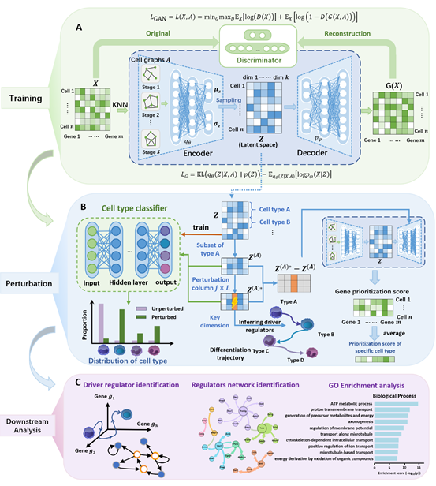

# STM-Finder: Identification of cell-state transition markers via graph-based latent-space perturbation

## Introduction
Cell-state transition markers have garnered substantial attention in regenerative and preventive medicine due to their pivotal role in dictating cellular trajectories during complex biological processes. However, conventional methods often overlook intercellular contextual influences and fail to delineate stage-specific markers underlying sequential cell-state transitions.

To address these limitations, we introduce STM-Finder, a deep learning framework based on a Cell Graph Convolutional Layer-Variational Autoencoder (CGCL-VAE) with a generative adversarial network, designed to identify cell state transition-markers (STM). Specifically, by integrating time-stage–specific graph neural network autoencoder modeling, systematic perturbation of latent dimensions, and decoder-driven prioritization score calculation, STM-Finder enables the identification of core dimensions and their associated STM, which are functionally shown to be implicated in the corresponding transition processes. Additionally, it allows the identification of gene modules that reflect cell-state transitions through the coordinated interactions among these STM. STM-Finder has been successfully applied to five distinct real-world datasets, including dentate gyrus development, pancreatic endocrinogenesis, liver development and maturation, hematopoiesis, and COVID-19, where it consistently demonstrated higher accuracy than conventional methods. Consequently, STM-Finder provides a computational framework for prioritizing candidate STM through systematic in silico perturbation, offering mechanistic hypotheses for downstream experimental validation.

---

## Workflow & Usage

### 1. Preprocessing
First, select highly variable genes to reduce computational burden and annotate your `h5ad` file with a `name.simple` column representing the biological stages of interest.

Run the preprocessing script:
```bash
python preprocessing/data_preprocessing_addSimp.py
```

### 2. Model Training
Initiate training of the CGCL-VAE model using the dataset-specific entry script (example for dentate gyrus):
```bash
python run_dentateGyrus.py
```

### 3. Latent Space Perturbation
1.  Use the classifier script to map cell-type labels to time-stage embeddings and train a cell-type classifier:
    ```bash
    python Emb_Cell_type_Classifier_Dentate_11.py
    ```
2.  Perform systematic perturbation of latent dimensions. This script also computes the difference matrix between perturbed and unperturbed embeddings, then aggregates results across all time stages.

### 4. Regulator Identification
1.  Reconstruct the gene prioritization score matrix:
    ```bash
    python run_GSE132188_resume_argparse.py
    ```
2.  Extract and visualize top regulators for each cell-type transition:
    ```bash
    python run_regus_for_allType_heatmap_fixed.py
    ```

### 5. Downstream Analysis
Reproduce all figures and perform additional biological analyses using scripts in the `downstream_analysis` directory.
